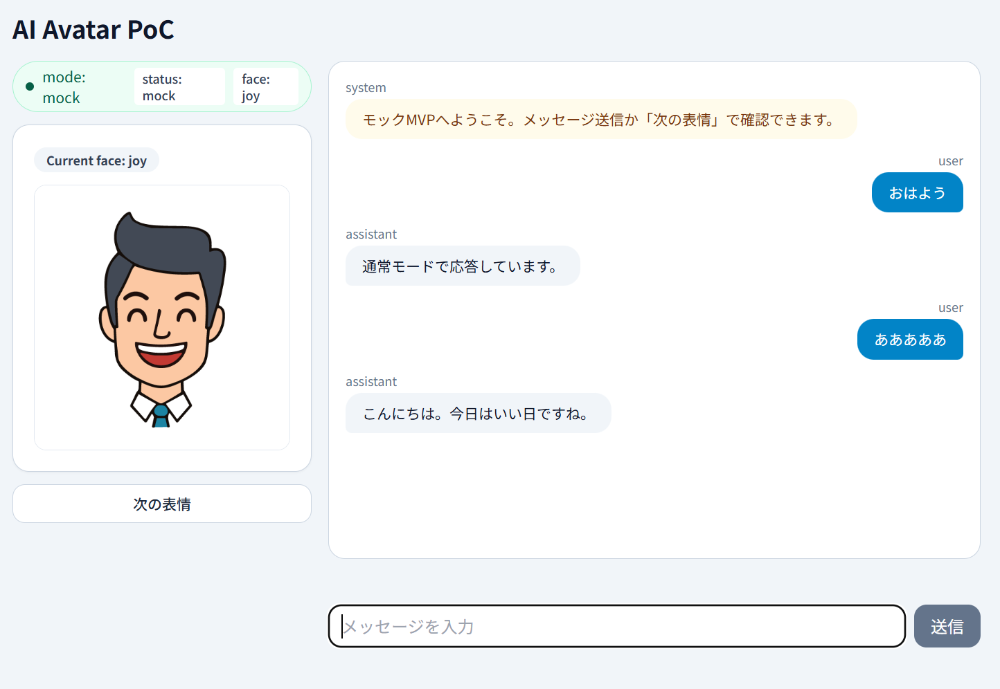

# AI Avatar PoC (Dify-Centered)

Difyを頭脳として使うAIアバターPoCです。  
応答テキストを `face + text` に正規化し、会話ログ表示・表情表示・音声再生を行います。

## Screen Capture



## Features

- Dify連携（P2）
  - `POST /chat-messages` 呼び出し
  - `answer` を `AvatarResponse` に正規化
  - `conversation_id` 継続
- ナレッジ活用（運用）
  - 新卒採用向けナレッジとソリューション系ナレッジをDify側で参照
  - 未記載事項は断定せず回答する運用を想定
- ステータス・エラー制御（P3）
  - `connected / misconfigured / error`
  - loading中の二重送信防止、再送復帰
- 体験強化（P4）
  - speaking状態表示、faceプレビュー、チャット内face表示
- 音声入力（P5）
  - Web Speech API（Edge/Chromeデスクトップ推奨）

## Setup

1. Install dependencies

```bash
npm install
```

2. Frontend env

```bash
cp .env.example .env
```

`.env` example:

```env
VITE_DIFY_API_URL=https://api.dify.ai/v1
VITE_DIFY_API_KEY=
VITE_DIFY_USER_ID=local-user-001
VITE_TTS_PROVIDER=browser
```

`VITE_TTS_PROVIDER`:
- `browser`: Browser SpeechSynthesis

3. Start frontend

```bash
npm run dev
```

## Render Deploy

Render公開版では Browser TTS を使用します。

1. Renderで `Web Service` を作成し、このリポジトリを接続
2. ルートの `render.yaml` を利用
3. Render Environment Variables を設定
   - `VITE_TTS_PROVIDER=browser`（Render既定）
   - `VITE_DIFY_API_URL`
   - `VITE_DIFY_API_KEY`
   - `VITE_DIFY_USER_ID`
4. デプロイ完了後、Render URLで動作確認

### Render公開版の動作確認結果

- Render URL上で `mode: dify` / `status: connected` を確認
- Dify応答の `face + text` 正規化、表情切替、会話継続（`conversation_id`）を確認
- Render公開版では `tts: browser` で読み上げ動作を確認

## Browser Notes

- 推奨ブラウザ: Microsoft Edge / Google Chrome（デスクトップ）
- Firefox / Safari / モバイルブラウザは初期PoCの動作保証対象外
- 音声認識はブラウザ実装依存のため、権限設定や環境ノイズに影響されます

## Dify Response Contract

想定する `answer`:

```json
{"face":"joy","text":"こんにちは！"}
```

またはフォールバック:

```text
[face:joy] こんにちは！
```

対応表情: `normal`, `joy`, `sad`, `angry`, `surprised`

## Real-time Information Limitation

- 現状PoCは、Dify上で接続したナレッジとプロンプトを中心に応答します。
- 外部のリアルタイムデータソースを直接参照しない構成のため、最新ニュース・天気・市況などは正確に回答できない場合があります。

## Documents

- `docs/architecture.md`
- `docs/dify-setup.md`
- `docs/demo-script.md`
- `specs/001-dify-poc/p2-preflight-checklist.md`

## Test & Build

```bash
npm run test
npm run build
```

## Notes

- `.env` はGit管理しない
- APIキーはREADME/ソースに直接書かない
- UI層は Dify raw を扱わず、adapter経由で `AvatarResponse` のみ扱う
